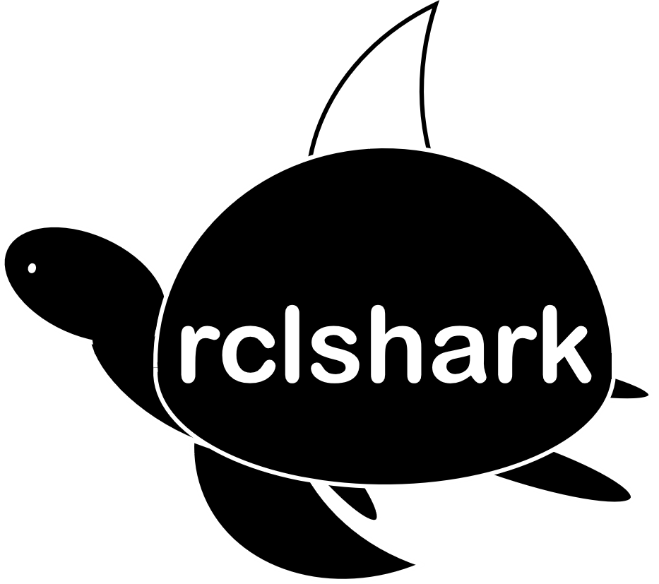
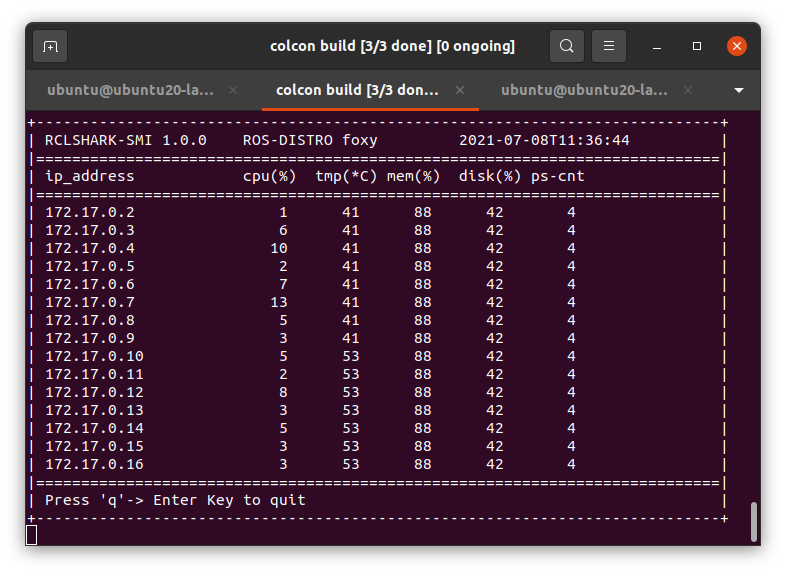
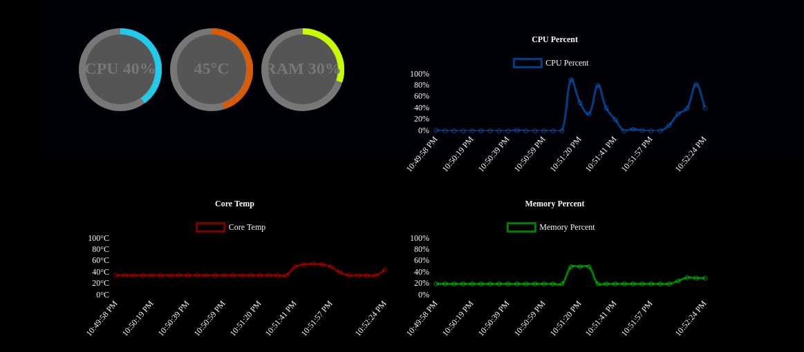

# rclshark​ :turtle::shark:

latest : [v1.0.2](https://github.com/Ar-Ray-code/rclshark/releases/tag/v1.0.2)

[解説（Zenn）](https://zenn.dev/array/articles/9fd8cb5941bb94)

[紹介ページ（github.io）](https://ar-ray-code.github.io/05_rclshark/index.html)

Monitor the status of computers on a network using the DDS function of ROS2.

開発者向けのツールで、リモートマシンへのSSHログインの際に必要なローカルIPアドレスを簡単に発見します。リモートマシンに対して拡張機能を追加し、CPU温度などのマシン内部の情報をログイン無しでモニタリングすることもできます。

rclsharkはセットアップされたデバイスに対してIPアドレス固定などのデバイスごとの面倒なセットアップ無しにIPアドレスの取得を行い、デバイスの状態を取得することができます。インストールも簡単で、組み込みコンピュータの新規開発のお供として役に立ちます。



## Documents

- Zenn : https://zenn.dev/array/articles/9fd8cb5941bb94
- DockerHub : https://hub.docker.com/r/ray255ar/rclshark
- Computer_msgs : https://github.com/Ar-Ray-code/computer_msgs
- rclshark-smi : https://github.com/Ar-Ray-code/rclshark-smi
- Website : https://ar-ray-code.github.io/05_rclshark

## Requirements

- ROS2 foxy-base [Installation](https://docs.ros.org/en/foxy/Installation.html)
- python3-colcon-common-extensions
- python3-psutil
- build-essential

## Support

- Ubuntu 20.04 (x86_64, Armv8) (Full support)
- Windows 11 (x86_64) (rclshark-smi only)


## 1. rclshark​ :turtle: :shark:

Repository : https://github.com/Ar-Ray-code/rclshark

rclshark is an IP address display system that takes advantage of the DDS publishing nature of the ros2 node to the local network, and can recognize any device with ROS2 installed.
rclshark is also a service server, and has a function to Repositoryrt computer status using psutil.

See [rclshark-smi](https://github.com/Ar-Ray-code/rclshark#rclshark-smi-turtle-shark) for details.

---

### Installation

#### ROS-Foxy Installation

If you want to know how to install ROS-Foxy , please check [ROS2-Foxy-Installation](https://docs.ros.org/en/foxy/Installation/Ubuntu-Install-Debians.html).

```bash
# ROS-Foxy & depends Installation
sudo apt update && sudo apt install curl gnupg2 lsb-release python3-psutil python3-colcon-common-extensions build-essential git

sudo curl -sSL https://raw.githubusercontent.com/ros/rosdistro/master/ros.key  -o /usr/share/keyrings/ros-archive-keyring.gpg
echo "deb [arch=$(dpkg --print-architecture) signed-by=/usr/share/keyrings/ros-archive-keyring.gpg] http://packages.ros.org/ros2/ubuntu $(lsb_release -cs) main" | sudo tee /etc/apt/sources.list.d/ros2.list > /dev/null

sudo apt install ros-foxy-base
```

#### rclshark backend installtion

After installation, rclshark will start automatically.

```bash
#rclshark installation
git clone --recursive https://github.com/Ar-Ray-code/rclshark.git
sudo bash rclshark/rclshark/install.bash foxy
```

If you want to enable rclshark immediately, run  `$ sudo systemctl start rclshark.service`.

#### uninstall

```bash
sudo bash ~/ros2_ws/src/rclshark/rclshark/install.bash uninstall
```

### Docker

Docker container is used for viewer testing and communication load testing, but can also be used as a Raspberry Pi replacement for trial purposes.

```bash
docker pull ray255ar/rclshark
```

RUN docker container
```bash
docker run -it --rm rclshark
```

---

### Quick check of rclshark

Since rclshark is an application that uses the basic functions of ROS2, you can find it with the ros2 command.

```bash
## Confirmation rclshark 1
ros2 node list | grep ip_
> /ip_192.168.11.10_end
> /ip_192.168.11.22_end
## Confirmation rclshark 2
ros2 service list | grep endcb
> /ip_192.168.11.10_endcb
> /ip_192.168.11.22_endcb
```

Now you can safely forget your IP address.:wink:


## 2. rclshark-smi (v1.0.0)​ :turtle: :shark:

Repository : https://github.com/Ar-Ray-code/rclshark-smi

You can use rclshark to check the hardware status of multiple computers. You don't even need to bother opening htop. Good for you! :blush:

IP addresses are sorted in ascending order and are dynamically added and removed.



###  Installation 

rclshark-smi is installed with rclshark. It can also be built and used as a regular ROS2 package. `ros2 run rclshark_smi rclshark_smi`

```bash
## Install
git clone --recursive https://github.com/Ar-Ray-code/rclshark.git
sudo bash rclshark/rclshark/install.bash foxy
## Run rclshark-smi
rclshark-smi
```

## Demo (v1.0.0)

[YouTube](https://youtu.be/SC5XEYPq4D0)


### Operation method

- 'q'-> Enter : exit rclshark-smi

### Known Problems​ ​(rclshark-smi < v1.0.1) :disappointed:

- If the rclshark process started using Docker is interrupted, rclshark-smi will freeze. In that case, rclshark-smi will exit as the Timeout after 5 seconds. Keep in mind that the same event can also happen with non-Docker rclshark.
- We are considering releasing a lightweight version of rclshark-smi that does not involve sending or receiving messages.
- To temporarily solve these problems, rclshark-smi v1.0.2 limits the display to only one time.


# Extended packages :shark::snake:

## 3. rclshark-bridge

Repository : https://github.com/Ar-Ray-code/rclshark-bridge

rclshark-bridge performs CSV conversion of data in order to use rclshark on other platforms.

## 4. rclshark-Web

Repository : https://github.com/Ar-Ray-code/rclshark-web

rclshark-web is data viewer

#### Installation

Before creating the web server, please set up the Python dependency module and ROS2 environment.

```bash
git clone https://github.com/Ar-Ray-code/rclshark-web.git
git clone https://github.com/Ar-Ray-code/rclshark-bridge.git
pip3 install -r rclshark-web/requirements.txt

source /opt/ros/foxy/setup.bash
python3 rclshark-bridge/rclshark_bridge/rclshark_bridge.py &
python3 rclshark-web/flask_main.py
```

Access `http://localhost:5000`




## About writer :turtle::shark:

- Ar-Ray : Japanese student.
- Blog (Japanese) : https://ar-ray.hatenablog.com/
- Twitter : https://twitter.com/Ray255Ar
